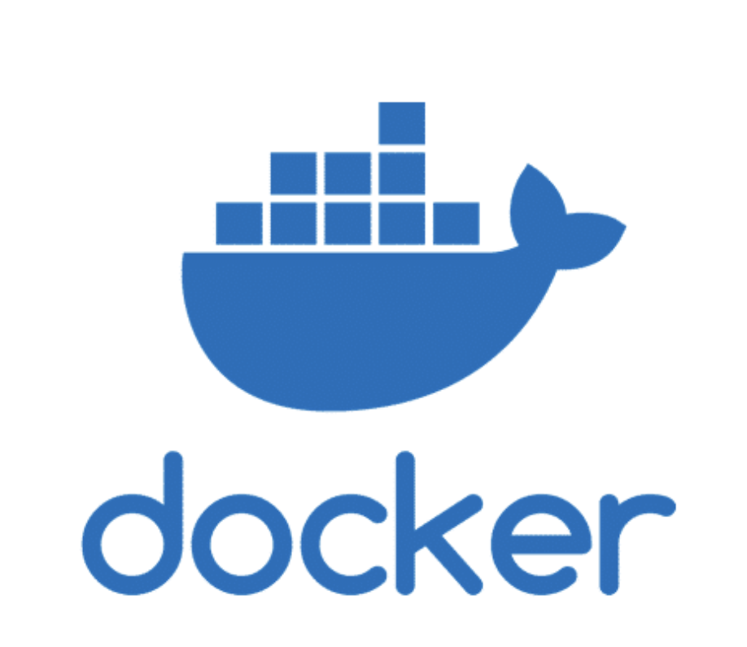

<p align="center">
    
</p>

# Inception

## Overview

Inception is a system administration and DevOps project, focused on mastering Docker and containerization concepts.
The goal is to build a secure, isolated multi-service infrastructure entirely using Docker Compose, without relying on pre-built images (except for the base distributions).

This project deploys a WordPress website running on Nginx with a MariaDB database, each service running in its own container and managed through Docker networks and volumes.

## Features

- Multi-container setup with Docker Compose
- Nginx reverse proxy (serving WordPress over HTTPS)
- MariaDB database service
- WordPress + PHP-FPM backend
- Persistent storage with mounted volumes
- Environment-based configuration for credentials and security
- Custom Dockerfiles for each service (no pre-built WordPress/Nginx/MariaDB images)

## Getting Started

### Prerequisites

- Docker
- Docker Compose

### Installation

1. `git clone https://github.com/yahyaeb/Inception.git` then `cd Inception`

2. `make up`

3. `docker ps`

## Usage

- Access WordPress at `https://localhost` or `https://yel-bouk.42.fr`
- Environment variables (database credentials, hostnames, etc.) are stored in the .env file and automatically loaded during build time.

## Project Structure

```
.
├── Makefile
├── setup.sh
├── cleaner.sh
├── .gitignore
├── README.md
└── srcs/
    ├── .env
    ├── docker-compose.yml
    ├── images/
    │   └── Docker_logo.png
    └── requirements/
        ├── mariadb/
        │   ├── Dockerfile
        │   └── docker-entrypoint.sh
        ├── nginx/
        │   ├── Dockerfile
        │   ├── nginx.conf
        │   └── ssl/
        │       └── certs.sh
        └── wordpress/
            ├── Dockerfile
            ├── fpm-www.conf
            └── script.sh


```

## Makefile Commands

| Command       | Description                                       |
| ------------- | ------------------------------------------------- |
| `make up`     | Build and start all containers                    |
| `make down`   | Stop and remove containers, networks, and volumes |
| `make clean`  | Remove images, containers, and volumes            |
| `make restart`| Rebuild everything from scratch                   |


## Security & Configuration

- Self-signed SSL certificate generated during Nginx setup
- All credentials are injected through the .env file (never hard-coded)
- Services communicate through a private Docker network (wpnet)
- Data is persisted in host directories:
/home/lepokile/data/mariadb
/home/lepokile/data/wordpress

## Learning Outcomes

- Through this project, I gained hands-on experience in:
    - Dockerfile creation and image layering
    - Docker Compose orchestration
    - Service networking and isolation
    - Persistent volume management
    - Environment variable management for configuration
    - Automating builds with Makefile


## Troubleshooting

If you encounter issues running this Dockerized web stack, try the following steps:

- **Check Docker Installation:**  
        Run `docker -v` to verify Docker is installed. If not, follow the official installation guide: [Install Docker Desktop](https://docs.docker.com/desktop/).

- **Permission Issues:**  
        If `make up` fails due to permissions, try running it with `sudo make up`.
        Or you can permanently fix it with these commands: 
            run `sudo usermod -aG docker "$USER"`, then
            `newgrp docker`

- **Clean Environment:**  
        If containers/images/volumes are causing conflicts, run `./cleaner.sh` to remove them and start fresh. **Warning:** This will delete all Docker images and volumes related to the project.


- **Configuration Files:**  
        Double-check your `.env` file for correct credentials and values. Missing or incorrect variables can cause build failures.

- **Docker Compose Version:**  
        Make sure you are using a compatible version of Docker Compose (`docker compose version`).

- **Logs & Debugging:**  
        Use `docker-compose logs <service>` to view logs for specific containers and diagnose issues.

- **Network Issues:**  
        If containers cannot communicate, check that the `wpnet` Docker network exists and is properly configured.
        Use `Docker network ls` 

- **Further Help:**  
        If you are still having trouble, submit a pull request or open an issue on GitHub and I'll try to assist you.

- **Bug Reports:**  
        If you find any bugs or issues, please report them so I can be addressed.

